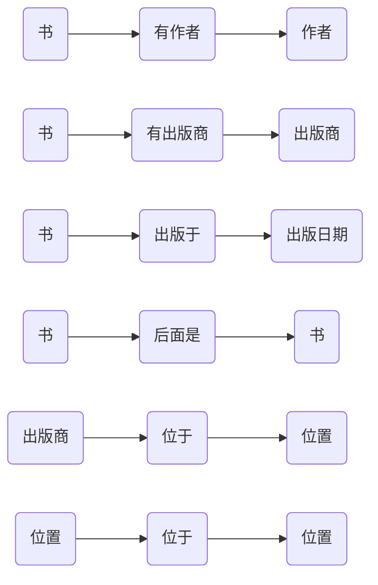
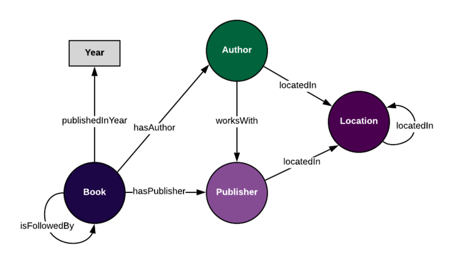

在这篇博客中，将引导您了解本体和知识知识图谱，讲述它们之间的区别以及它们如何组织大量数据和信息。  
[***英文原文链接***](https://enterprise-knowledge.com/whats-the-difference-between-an-ontology-and-a-knowledge-graph/)

## 什么是本体？

本体是语义数据模型，用于定义domain中事物的类型以及可用于描述它们的属性。本体是广义的数据模型，这意味着它们仅对具有某些属性的事物的一般类型进行建模，而并不包含有关我们domain中具体个体的信息。例如，本体论不能描述您的狗，斑点和它的所有个体特征，主要描述狗的一般概念，尝试描述大多数狗可能具有的特征。这样做可以使我们在将来用本体来描述其他狗。

本体有三个主要组成部分，通常描述如下:

- 类： 存在于数据中的不同类型的。
- 关系：连接两个类的属性。
- 属性：描述单个类的属性。

例如，假设我们有以下关于书籍、作者和出版商的信息：

首先，我们要标识类(数据中事物的唯一类型)。这个示例数据似乎捕获了关于**书籍的信息**，因此它是类的一个很好的候选项。具体来说，示例数据捕获了关于书籍的某些类型的内容，比如**作家**和**出版商**。再深入一点，我们可以看到我们的数据还捕获了关于**出版商**和**作者**的信息，比如他们的**位置**。这给我们留下了这个例子中的四个类：

- 书籍
- 作者
- 出版商
- 位置

下一步，我们需要标识关系和属性(为了简单，我们可以将关系和实体属性都视为属性)。使用我们在之前定义的类，我们可以查看数据并开始列出我们看到的每个类的所有属性。例如，在书籍类中，一些属性可能是:

- 书籍有作者
- 书籍有出版商
- 书集是在一个日期出版的
- 书籍之后有续集(其他书)

其中一些属性是连接两个类的关系。例如，关系属性“**书籍**有**作者**”是一个连接书籍类和作者类的关系。其他属性，像“书籍发布的日期”是实体属性，只描述一个类，而不是将两个类连接在一起。

需要注意的是，这些属性可能适用于任何给定的书籍，但它们不一定适用于每一本书。例如，很多书都没有续集。这在我们的本体中很好，因为我们只是想确保我们捕获了可能适用于许多(但不一定是所有)书籍的属性。

虽然上面的属性列表很容易阅读，但是重写这些属性以更清楚地定义我们的类和属性会有所帮助。例如，“书籍有作者”可以写成:

尽管你可以包括更多的属性，这取决于你的用例，对于这个博客，我已经定义了以下属性:

记住，我们的本体是一个通用的数据模型，这意味着我们不想在本体中包含关于特定书籍的信息。相反，我们希望创建一个可重用的框架，将来我们可以用它来描述其他书籍。

当我们结合类和关系时，我们能够以图的形式查看本体:

## 什么是知识图谱？

使用本体作为一个框架，我们可以添加关于个别书籍、作者、出版商和位置的真实数据来创建一个知识图谱。利用上面表中的信息和本体，我们可以创建每个本体关系的特定实例。比如，如果我们的本体中有这样的关系“书籍→有作者→作者”，这个关系的单个实例如下：

如果我们把我们拥有的关于《杀死一只知更鸟》这本书的所有信息加进去，我们可以看到知识图谱的开端：

如果我们对所有的数据都这么做，我们最终会得到一个使用本体对数据进行编码的图。通过使用知识图谱，我们可以将数据看作一个关系网络，而不是作为单独的表格在我们无法理解的数据点间绘制新的连接。具体来说，使用SPARQL，我们可以查询数据和使用推理功能（让知识图谱建立之前没有定义的连接）。

那么本体和知识图谱有什么不同呢？

正如你在上面例子中所看的，当你将本体（我们的数据模型）应用到一组单独的数据点（书籍、作者和出版商数据）时，那么就是创建了一个知识图谱。换句话说：

**本体+数据=知识图谱**
